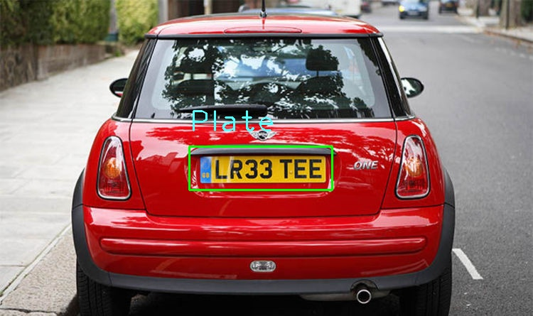

   
  
# Yplate

## Detect Vehicle Number plates with YOLOv3 powered by OpenCV >= 3.x 

### Updates:
It will be updated to `pypi` and `conda` soon with stable releases

### Install:

#### a. With `wheel` 

    pip install https://github.com/deepraj1729/yplate/releases/download/0.0.1/yplate-0.0.1-py3-none-any.whl

#### b. With `tar.gz` 
    
    pip install https://github.com/deepraj1729/yplate/releases/download/0.0.1/yplate-0.0.1.tar.gz
    
    
# Usage:

### Command-line Arguments:-

1. `detect`

2. `crop`

## `detect`

### (1.a)  Detect plates automatically (detected image will be saved to output directory always with original starting file name) 

    yplate detect images/car2.jpg

### (1.b)  Detect plates and custom save it with a valid new filename (detected image will be saved to output directory with custom file name) 
    
    yplate detect images/car2.jpg --save out2.jpg
    
### (1.c)  Hide output detected image

    yplate detect images/car2.jpg --hide_img
    
### (1.d)  Hide output in command-line

    yplate detect images/car2.jpg --hide_out

### (1.e)  Don't save output image 

    yplate detect images/car2.jpg --save none

## `crop`

### (2.a)  Crop plates automatically ( Cropped plates will be saved to 'plates/' directory always with original starting file name)

    yplate crop images/car2.jpg

 

### (2.b)  Detect plates and custom save it with a valid new filename (Cropped image will be saved to output directory with starting custom file name)
    
    yplate crop images/car2.jpg --save plate2.jpg
    
### (2.c)  Hide cropped image in command-line

    yplate crop images/car2.jpg --hide_img
    
### (2.d)  Hide output in command-line

    yplate crop images/car2.jpg --hide_out

### (2.e)  Don't save output image

    yplate crop images/car2.jpg --save none

### Check `yplate` version:

    yplate -v

### Model Configuration:

    yplate --config

## Sample Outputs:

### Detected Plates:

     

### Corresponding plates:

            

